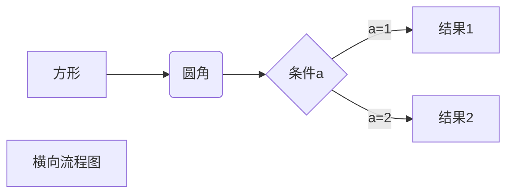
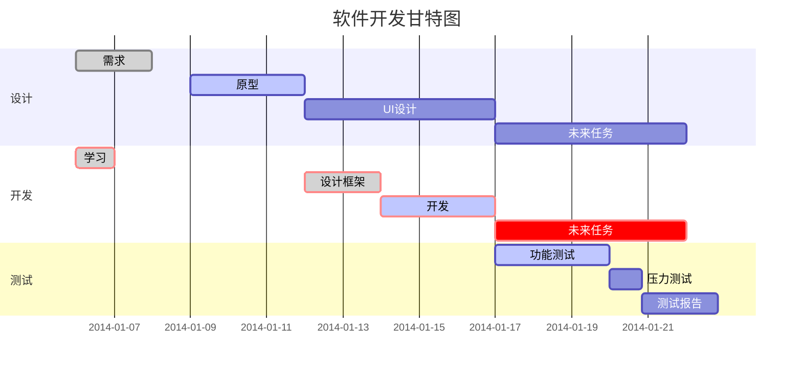

# Markdown 学习

左下角第二个按钮是“源代码模式”，点它使所有标签可见~

### 标题

- 一级标题：在底部用一行等号或者在左侧用`#`加空格标记。

- 二级标题：在底部用一行`-`或者在左侧用两个`#`加空格标记。

- 用不同数量的 “#” 表示1-6级的标题。 

  ```markdown
  # 一级标题
  ## 二级标题
  ### 三级标题
  #### 四级标题
  ##### 五级标题
  ###### 六级标题
  ```

- 这个文档里的小标题都是三级标题~

### 特殊文本

1. *斜体文本*和**粗体文本**以及***粗斜体文本***
   - 斜体文本两侧各有一个`*`。
   
     `*斜体文本*`
   
   - 粗体文本两侧各有两个`*`。
   
     `**粗体文本**`
   
   - 粗斜体文本两侧各有三个`*`。
   
     `***粗斜体文本***`
   
2. 分隔线：三个或者更多个星号或者减号或者下划线。中间可以加空格，例如` * * * `。

   分隔线如下：

---

4. ~~删除线~~：在文本两侧各加上两个波浪线`~~文本~~`。

5. <u>带下划线文本</u>：通过HTML的标签来实现。`<u>文本</u>`

### 脚注

   通过用`[^标签]`来实现。脚注内容要在另外在旁边定义。[^一个小例子]如下：

[^一个小例子]:这是一个脚注的例子，把鼠标放到“一个小例子”小框框上可以看到这一行字。

### 列表

+ 用`+`或者`*`或者`-`加一个空格都能构造一个点点（就像这行的起始）。

+ 数字的小标题直接打数字加一个小点点再加空格。

  ```markdown
  * 这是列表
  - 这也是列表
  + 这还是列表
  1. 这个是带数字的列表
  ```


### 区块
用 “>” 创建区块。每多一个 “>” 说明进入下一层嵌套。

```markdown
   > 最外层的区块。
   > > 嵌套1
   > > > 嵌套2
   > > 和列表一样，多打一个回车就可以退出一层啦。
   > 又退出来啦。
```

上面的代码的效果：

   > 最外层的区块。
   >
   > > 嵌套1
   > >
   > > > 嵌套2
   > >
   > > 和列表一样，多打一个回车就可以退出一层啦。
   >
   > 又退出来啦。

### 代码

* 段落中的片段代码可以用反引号 (和波浪线同一个键) 包起来。例如：`System.out.println();`

* 可以用三个反引号包裹一块代码，并且指定一种语言(也可以不指定)。

  ```java
  public static void main(String[] args){
      System.out.println("Hello world!");
  }
  ```

### 链接

- 方括号包裹连接名称，后面圆括号包裹链接地址。也可以直接用尖括号包括链接地址。

  `[这是我的GitHub](https://github.com/HeheLi25)`

  效果：[这是我的GitHub](https://github.com/HeheLi25)，这是带名字的写法。

  `<https://github.com/HeheLi25>`

  <https://github.com/HeheLi25>，这是尖括号的写法。

- 还可以用变量代替网址，既在方括号内放一个变量，然后跟一个冒号，后面打网址：

  [1]:https://github.com/HeheLi25

  上面这一行可以放在文档最后，这样在文档中只要我打两个方括号，一个里面随便打什么，另一个里面放1，前一个方括号里的内容就会变成一个超链接。
  
  比如：`[这还是我的GitHub][1]`
  
  效果：[这还是我的GitHub][1]。

### 图片

- 图片的格式是：``

  例如：

  

  以上图片的代码是：``

  - 显然这个猫猫图片有点太大了，用 img 标签可以设置图片大小，高度宽度：
  - ``效果如下：
  
  

### 表格

Markdown 制作表格使用 `|` 来分隔不同的单元格，使用 `-` 来分隔表头和其他行。

```markdown
|水果|蔬菜|
|---|---|
|橙子|茄子|
|草莓|番茄|
```

| 水果 | 蔬菜 |
| ---- | ---- |
| 橙子 | 茄子 |
| 草莓 | 番茄 |

- `-:` 设置内容和标题栏居右对齐。
- `:-` 设置内容和标题栏居左对齐。
- `:-:` 设置内容和标题栏居中对齐。

```markdown
| 左对齐 | 右对齐 | 居中对齐 |
| :-----| ----: | :----: |
| 单元格 | 单元格 | 单元格 |
| 单元格 | 单元格 | 单元格 |
```


| 左对齐 | 右对齐 | 居中对齐 |
| :-----| ----: | :----: |
| 单元格 | 单元格 | 单元格 |
| 单元格 | 单元格 | 单元格 |

### HTML元素

- 用HTML可以在Markdown文档内撰写一些标签。

  如：`<kbd> <b> <i> <em> <sup> <br>`等.

- 一些例子：

  ```markdown
  使用 <kbd>Ctrl</kbd>+<kbd>Alt</kbd>+<kbd>Del</kbd> 重启电脑
  ```

  效果：使用 <kbd>Ctrl</kbd>+<kbd>Alt</kbd>+<kbd>Del</kbd> 重启电脑

  - `<sup>`：上角标。如：`10<sup>23</sup>`效果：10<sup>23</sup>
  - `<sub>`：下角标
  - `<b>`：粗体。如：`</b>粗体文字</b>`效果：<b>粗体文字</b>
  - `<i>`：斜体`<i>斜体文字</i>`效果：<i>斜体文字</i>

### 转义

- 转义字符：反斜线`\`，加在其他符号(如\*)前面来获得普通的符号。

### 公式

- 公式：两个美元符`$$`包裹。

- 点击以下公式查看源码。

$$
\mathbf{V}_1 \times \mathbf{V}_2 =  \begin{vmatrix} 
\mathbf{i} & \mathbf{j} & \mathbf{k} \\
\frac{\partial X}{\partial u} &  \frac{\partial Y}{\partial u} & 0 \\
\frac{\partial X}{\partial v} &  \frac{\partial Y}{\partial v} & 0 \\
\end{vmatrix}
$$

画图

#### 横向流程图



#### 竖向流程图

```flow
st=>start: 开始框
op=>operation: 处理框
cond=>condition: 判断框(是或否?)
sub1=>subroutine: 子流程
io=>inputoutput: 输入输出框
e=>end: 结束框
st->op->cond
cond(yes)->io->e
cond(no)->sub1(right)->op
​```
```

#### 标准流程图

```flow
st=>start: 开始框
op=>operation: 处理框
cond=>condition: 判断框(是或否?)
sub1=>subroutine: 子流程
io=>inputoutput: 输入输出框
e=>end: 结束框
st(right)->op(right)->cond
cond(yes)->io(bottom)->e
cond(no)->sub1(right)->op
​```
```

#### UML时序图

```sequence
对象A->对象B: 对象B你好吗?（请求）
Note right of 对象B: 对象B的描述
Note left of 对象A: 对象A的描述(提示)
对象B-->对象A: 我很好(响应)
对象A->对象B: 你真的好吗？
```


```sequence
Title: 标题：复杂使用
对象A->对象B: 对象B你好吗?（请求）
Note right of 对象B: 对象B的描述
Note left of 对象A: 对象A的描述(提示)
对象B-->对象A: 我很好(响应)
对象B->对象C: 你好吗
对象C-->>对象A: 对象B找我了
对象A->对象B: 你真的好吗？
Note over 对象C,对象B: 我们是朋友
participant D
Note right of D: 没人陪我玩
```


#### 甘特图



